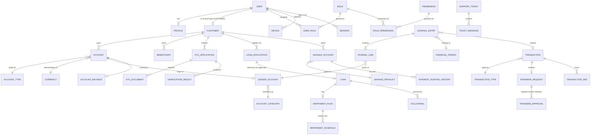

# Ecoswift Bank — Database Architecture

**Phase 2B deliverable.** Enterprise PostgreSQL + Prisma architecture for Ecoswift Bank. This document covers standards, structure, performance/HA strategy, and the migration approach. The double-entry ledger gets its own deep-dive in [`ledger-design.md`](ledger-design.md); the full table-by-table field reference is in [`schema-reference.md`](schema-reference.md).

The schema lives at [`prisma/schema.prisma`](../prisma/schema.prisma) — **69 models, ~40 enums**, organized into the 13 modules from the Phase 2B brief, each mapped back to the bounded contexts designed in Phase 2A ([`domain-architecture.md`](domain-architecture.md)).

---

## Database Standards

| Standard | How it's applied |
|---|---|
| PostgreSQL | 16 (any 13+ works; 16 is what's pinned in `docker-compose.yml`) |
| Prisma ORM | Schema-first, `prisma-client-js` generator, output to `packages/database/generated/client` |
| UUID primary keys | Every model: `id String @id @default(dbgenerated("gen_random_uuid()")) @db.Uuid` — generated by **Postgres**, not the application, so direct-SQL inserts (migrations, admin tooling, another language's service) get a valid ID without going through Prisma |
| UTC timestamps | Every timestamp column is `@db.Timestamptz(6)`. Postgres stores `timestamptz` internally as UTC regardless of session timezone — there is no ambiguity to introduce as long as nothing casts to a naive `timestamp` |
| Optimistic locking | `version Int @default(0)` on the aggregates that face genuine concurrent-write contention: `User`, `Customer`, `Account`, `AccountBalance`, `Loan`, `SavingsAccount`. **Not** applied blanket — most tables here are either append-only (`JournalEntry`, `AuditLog`) or effectively single-writer (catalog/config tables), where optimistic locking adds overhead without preventing a real race |
| Foreign keys | Every relationship is a real FK, `onDelete` behavior chosen deliberately per relationship — see § Deletion Policies below |
| Soft deletes | `deletedAt DateTime?` only where a hard delete would destroy history that must survive the record's "active" life: `User`, `Customer`, `Beneficiary`. **Not** applied to financial history (`Transaction`, `JournalEntry`, `Loan`, etc.) — those are never deleted at all, soft or hard; they end via a status transition (`CLOSED`, `REVERSED`) instead, because even a soft-deleted financial record must remain queryable for statements/audits without a `WHERE deletedAt IS NULL` filter accidentally hiding it |
| Composite indexes | Applied where queries genuinely filter/sort on the combination, not just declared reflexively — see § Index Strategy |
| Unique constraints | Business-meaningful uniqueness (`accountNumber`, `email`, `transactionReference`, `journalNumber`, `(resource, action)` on `Permission`, etc.), not just the PK |
| Check constraints | Prisma's schema DSL has no native multi-row or arithmetic CHECK support, so these are hand-authored SQL appended to the initial migration — see § Check Constraints & Triggers |
| Transactional consistency / ACID | Postgres gives this by default; the schema's job is to not undermine it — hence immutable ledger/audit tables (below) rather than relying on application discipline alone |

## Naming Conventions

- **Models**: PascalCase, singular (`Customer`, `JournalEntry`).
- **Tables**: snake_case, plural, via `@@map` (`customers`, `journal_entries`).
- **Fields**: Prisma-idiomatic camelCase, kept as the Postgres column name for single-word fields (`id`, `email`, `status`); multi-word fields get an explicit snake_case `@map` (`customerNumber` → `customer_number`) so raw SQL, BI tools, and anything outside Prisma sees conventional identifiers rather than quoted camelCase. This is a deliberate middle ground — full snake_case everywhere (with `@map` on every field including single-word ones) is more common in very DBA-heavy shops, but adds volume without changing behavior for single-word names where camelCase and snake_case are identical anyway.
- **Enums**: PascalCase type name, SCREAMING_SNAKE_CASE members (`AccountStatus.PENDING_ACTIVATION`).
- **Indexes/constraints**: left to Prisma's default generated names (`{table}_{column}_key`, `{table}_{column}_fkey`) — predictable and consistent without hand-naming ~230 objects.

## Extensible Catalogs vs. Fixed Enums — the recurring judgment call

Several brief items look like they should be "the same kind of thing" but deliberately aren't:

- **`AccountType` is a table; `AccountStatus` is an enum.** Account types are a product catalog — the bank adds a new one (e.g. a new savings variant) as a data change, not a migration. Account status is a finite state machine (`business-rules.md` § Account States) where an invalid value should be a type error, not a row that happens not to exist in a lookup table yet.
- **`TransactionType` is a table; `TransactionStatus` is an enum.** Same reasoning — transaction kinds grow over time (a new fee type, a new disbursement kind), transaction status is a fixed lifecycle.
- **`Currency` and `Country` are tables**, not enums — genuinely large, extensible, metadata-bearing (symbol, decimal places, dialing code) reference data, the textbook case for a real table.
- **"General Ledger" and "Chart of Accounts" are not separate tables.** Per standard double-entry accounting theory, the general ledger *is* the journal (`JournalEntry` + `JournalLine`) and the chart of accounts *is* the `LedgerAccount` catalog. A separate `GeneralLedger` table would just be a second, driftable copy of what `JournalLine` already represents — see `ledger-design.md`.

## Module Map

| Module | Models |
|---|---|
| Identity | `User`, `Profile`, `Device`, `Session`, `OtpChallenge`, `TwoFactorCredential`, `BackupCode`, `Role`, `Permission`, `RolePermission`, `UserRole` |
| Account Management | `Customer`, `Account`, `AccountType`, `Currency`, `Country`, `Beneficiary` |
| Accounting / Ledger | `AccountCategory`, `LedgerAccount`, `AccountBalance`, `JournalEntry`, `JournalLine`, `FinancialPeriod` |
| Transactions | `TransactionType`, `Transaction`, `TransferRequest`, `TransferLimit`, `TransferApproval`, `FeeSchedule`, `TransactionFee`, `ExchangeRate` |
| Notifications | `NotificationTemplate`, `Notification`, `EmailQueue`, `SmsQueue`, `PushQueue`, `AuditNotification` |
| KYC | `KycApplication`, `KycDocument`, `VerificationResult`, `ComplianceNote` |
| Loans | `LoanProduct`, `LoanApplication`, `Loan`, `RepaymentPlan`, `RepaymentSchedule`, `Collateral` |
| Savings | `SavingsProduct`, `SavingsAccount`, `InterestRule`, `InterestPostingHistory` |
| Reporting | `Statement`, `StatementRequest`, `ReportJob`, `AuditReport` |
| Audit | `AuditLog`, `ActivityLog`, `SecurityEvent`, `LoginHistory` |
| API | `ApiKey`, `WebhookEndpoint`, `WebhookEvent`, `WebhookDelivery` |
| Configuration | `ApplicationSetting`, `SystemSetting`, `FeatureFlag` |
| Support | `SupportCategory`, `SupportTicket`, `TicketMessage` |

`WebhookEndpoint` isn't in the brief's literal table list but is structurally required — a `WebhookDelivery` needs somewhere to deliver *to*; it's the registered-URL half of "Webhook Events/Deliveries."

## Entity-Relationship Overview

A full 69-entity ER diagram is unreadable as a single artifact. What follows is the module-level relationship map (see `schema-reference.md` for every table's exact columns, and `ledger-design.md` for the Accounting module's internal detail).

## Deletion Policies

Three `onDelete` behaviors are used, chosen per relationship rather than a single blanket rule:

| Behavior | Used for | Why |
|---|---|---|
| `Restrict` | Any FK into `Customer`, `Account`, `User` (as owner), `LedgerAccount`, `Loan`, `SavingsAccount`, catalog rows referenced by financial records | The default for anything financial or identity-core. Postgres refuses the delete outright — combined with soft-deletes (`deletedAt`) on `User`/`Customer` instead of hard deletes, a `Restrict` FK should in practice never actually block a legitimate operation, because the legitimate operation was never "hard-delete a customer" to begin with. |
| `Cascade` | Genuine parent-child detail rows that only exist attached to their parent: `JournalLine`→`JournalEntry`, `KycDocument`/`VerificationResult`/`ComplianceNote`→`KycApplication`, `TicketMessage`→`SupportTicket`, `RepaymentSchedule`→`RepaymentPlan`, `RolePermission`/`UserRole`→`Role`/`User`, `Profile`→`User` | Deleting the parent legitimately means deleting the child too — there's no independent meaning to a `JournalLine` whose `JournalEntry` no longer exists. (In practice `JournalEntry` is never deleted at all — see immutability triggers — so this cascade is a safety definition, not a path that's ever exercised.) |
| `SetNull` | Optional/nullable audit-style references: `Transaction.initiatedBy`→`User`, `ReportJob.requestedBy`→`User`, `Notification.recipientUserId`→`User`, `SupportTicket.assignedTo`→`User`, etc. | Losing the referencing user (offboarded staff, deleted test account) shouldn't cascade-delete unrelated financial/operational history — it should just null out "who did this," which the surrounding audit trail (`AuditLog`) still has a durable record of independently. |

## Check Constraints & Triggers

Prisma's schema DSL supports column-level types but not arbitrary `CHECK` expressions or triggers, so these are hand-authored SQL appended to `prisma/migrations/<timestamp>_init_banking_schema/migration.sql`, applied and verified against a live Postgres instance as part of this phase (not just written and hoped-correct):

- **Positive-amount checks**: `journal_lines.amount > 0`, `exchange_rates.rate > 0`, `loans.principal_amount > 0`, etc. — a small, deliberate set on the fields where a zero/negative value is unambiguously a bug, not a valid business case.
- **Range-ordering checks**: `loan_products` (`min_amount ≤ max_amount`, `min_term ≤ max_term`), `transfer_limits` (`per_transaction ≤ daily ≤ monthly`), period date ranges (`end_date ≥ start_date`).
- **Ledger immutability triggers**: `journal_entries` and `journal_lines` reject `UPDATE`/`DELETE` outright (`fn_prevent_mutation`) — correcting a mistake is always a new compensating entry, never an edit. `audit_logs` gets the same treatment for the same reason (tamper-evidence).
- **The balanced-journal-entry trigger** — the database-level enforcement of the Phase 2B **CRITICAL REQUIREMENT**. Full detail, including a live test transcript proving it rejects an unbalanced entry and accepts a balanced one, is in [`ledger-design.md`](ledger-design.md).

**What's intentionally *not* a CHECK constraint**: `AccountBalance` non-negativity. Whether an account may go negative depends on `AccountType.allowsOverdraft`, which is per-row config, not a fixed rule — a blanket `CHECK (current_balance >= 0)` would be wrong for overdraft-enabled products. This is enforced in the application layer (`LimitEnforcementService` / `AccountFreezePolicy`, per `domain-architecture.md`), which is the correct layer for a conditional business rule; recorded here so it isn't mistaken for an oversight.

## Index Strategy

Every field the brief calls out explicitly is indexed, either via a `@unique` constraint (which Postgres backs with an index automatically) or an explicit `@@index`:

| Field | Index | Note |
|---|---|---|
| Account Number | `accounts.account_number` — unique | |
| Customer ID | `@@index([customerId])` on every table with that FK (`accounts`, `beneficiaries`, `kyc_applications`, `loan_applications`, `loans`, `savings_accounts`, `support_tickets`, `transfer_limits`) | |
| Email / Phone | `users.email`, `users.phone` — unique | |
| Transaction Reference | `transactions.transaction_reference` — unique | (an earlier draft also had a redundant explicit `@@index` on the same column — removed, see § Bottlenecks Identified) |
| Journal Number | `journal_entries.journal_number` — unique | same redundancy removed |
| Ledger Account | `journal_lines: @@index([ledgerAccountId, createdAt])`, `ledger_accounts.code` — unique | the composite index is what makes "get this ledger account's postings in order" fast, which is the actual query shape (balance reconciliation, statements) |
| Status | `@@index([status])` on `transactions`, `loans`, `loan_applications`, `kyc_applications`, `support_tickets`, `savings_accounts`, `report_jobs`, plus composite `[status, ...]` where a second predicate is always present (`webhook_deliveries: [status, nextRetryAt]`, `email/sms/push_queue: [status]`) | |
| Created Date | `@@index([createdAt])` on `transactions`, `audit_logs`, `security_events`, `notifications`; composite where paired with another filter (`journal_lines: [ledgerAccountId, createdAt]`, `activity_logs: [userId, createdAt]`, `login_history: [userId, loggedInAt]`) | |
| Currency | FK columns auto-indexed by Prisma for every relation; no bare `currencies.iso_code` index needed beyond its `@unique` | |
| Statement Date | `statements: @@index([accountId, periodStart])` | |
| KYC Status | `kyc_applications: @@index([status])` | |

**Composite indexes follow query shape, not a rule of "index every column."** E.g. `journal_lines` is indexed on `(ledgerAccountId, createdAt)` because "this ledger account's postings, in order" is the actual access pattern (balance reconciliation, statement generation) — a bare index on `ledgerAccountId` alone would still need a sort at query time.

## Bottlenecks Identified & Improvements Made

Caught and fixed during this phase, not left as "future work":

1. **Redundant indexes.** `transactions.transaction_reference`, `journal_entries.journal_number`, `currencies.iso_code`, and `customers.customer_number` each originally had *both* a `@unique` constraint (which creates an index) *and* a separate explicit `@@index` on the same single column — two indexes doing the same job, doubling write-time index-maintenance cost for zero read benefit. Removed all four before the migration was applied (verified via the final generated SQL, not just the schema source).
2. **Ledger correctness can't be application-only.** An earlier design draft would have relied on `JournalEntryFactory` (application code) as the *only* enforcement of "debits equal credits." That's necessary but not sufficient for a system with the CRITICAL REQUIREMENT this brief specifies — a direct-SQL write, a bug in a future service, or a bypassed factory would silently corrupt the ledger. Added the deferred constraint trigger (§ Check Constraints & Triggers above) as a database-level backstop, and proved it works against a live database rather than asserting it in prose.
3. **Normalization: `TransferRequest.currencyId` was a duplicate fact.** `TransferRequest` is a strict 1:1 extension of `Transaction` describing the same money movement — its currency can never legitimately differ from `Transaction.currencyId`, so storing it a second time was pure drift risk (update one, forget the other, and the two disagree with no constraint to catch it). Removed during the quality-gate normalization pass; the schema was regenerated and the migration re-applied and re-verified against a live database after the fix, not just edited in source. `TransferRequest.requestedAmount`, by contrast, was kept — it represents pre-execution customer intent, which can legitimately differ from `Transaction.amount` (fees, FX slippage), so that one is real information, not redundancy. See `schema-reference.md` § TransferRequest.

## Performance & Operations Recommendations

These are recommendations for Phase 2C (Infrastructure) to implement, not applied here — Phase 2B is data architecture, not infrastructure provisioning.

### Connection Pooling
Application services should never connect directly to Postgres at high concurrency — route through PgBouncer (transaction-pooling mode) or Prisma's own Accelerate/Data Proxy. Each of the 12+ services in `services/*` opening its own raw connection pool against one Postgres instance is the single most likely early production bottleneck given the monorepo's service count; a pooler in front of Postgres is not optional at this service count.

### Read Replicas
Reporting (`ReportJob`, `Statement` generation) and Auditor-role queries (`AuditLog`, `ledger` read access) are natural candidates to route to a **read replica** rather than the primary — they're read-heavy, latency-tolerant (a statement being a few seconds stale is fine), and otherwise compete for I/O with transactional writes on the hot path (transfers, ledger postings). Recommend: Postgres streaming replication, one read replica minimum, with `@ecoswift/database`'s `PrismaService` extended (Phase 2C/3) to support a read/write client split.

### Table Partitioning
Two tables are the clear candidates — both append-only and unbounded-growth: **`journal_lines`** and **`audit_logs`**. Recommended strategy: native Postgres **range partitioning by `created_at`, monthly**. A worked reference implementation (the exact `PARTITION BY RANGE` DDL, partition-creation approach) is provided in `ledger-design.md` § Partitioning — **deliberately not applied to the live migration in this phase**. Reasoning: Prisma's migration diffing doesn't understand a table it created as partitioned out from under it; converting a table Prisma manages into a manually-partitioned one mid-Phase-2B risks confusing `prisma migrate dev` on every subsequent schema change during active iteration (Phase 2B/2C/3 will all still be touching this schema). The DDL is ready to apply as a dedicated, hand-run ops migration once real volume projections justify it and the schema has stabilized — applying it opportunistically now would be optimizing before there's data to prove the optimization matters, at the cost of every future `prisma migrate dev` needing manual reconciliation.

### Archiving Strategy
For partitioned tables, old partitions (e.g. journal lines older than the regulatory retention minimum) get detached and moved to cold storage rather than deleted — `AuditLog`/`JournalLine` retention is a compliance requirement (`RetentionPolicy`, `domain-architecture.md`), not just a housekeeping choice. Detach-and-archive (not delete) preserves the ability to reconstruct history if ever legally required, while keeping the hot table small.

### Query Optimization
- Prefer the `AccountBalance` projection for any "what's the balance" read — never `SUM()` the full `JournalLine` history at request time in a hot path; that's what the projection exists to avoid. Full re-summation is the reconciliation/audit path, not the display path.
- `Transaction`/`TransferRequest` status queries should filter by `status` first (indexed) before any date-range narrowing, matching the composite indexes above.

### Caching Strategy
Redis (already provisioned in `docker-compose.yml` from Phase 1) is the natural cache layer for: `Currency`/`Country`/`AccountType`/`TransactionType` catalogs (near-static, high read volume, safe to cache aggressively with a long TTL and explicit invalidation on `ConfigurationChanged`-style admin writes), `FeatureFlag` evaluation results, and rate-limit counters (already used for `ThrottlerModule` in every Phase 1 app). Do **not** cache `AccountBalance` beyond what the projection itself already is — caching a cache invites a second, harder-to-reconcile staleness problem.

### Backup Strategy
- Continuous WAL archiving (point-in-time recovery), full base backup daily, retained per the same regulatory minimums driving `AuditLog`/`JournalLine` retention.
- Backups must be tested by actual restore drills, not just verified to exist — a bank whose backups have never been restored doesn't actually have a backup strategy, it has an assumption.

### Disaster Recovery Preparation
- Read replica (above) doubles as a warm standby for failover, promoted on primary failure.
- RPO/RTO targets are a business decision for Phase 2C, not invented here, but the schema doesn't block any RPO down to "zero data loss" — synchronous replication is a deployment-topology choice layered on top of this schema, not something the schema needs to change to support.

## Migration Strategy

- **Tooling**: Prisma Migrate, config via [`prisma.config.ts`](../prisma.config.ts) (the modern replacement for the now-deprecated `package.json#prisma` key — migrated proactively in this phase specifically because the brief asks to minimize future refactoring before production, and staying on a key Prisma has already announced removing in v7 would be exactly the kind of avoidable rework that instruction is about).
- **Naming**: `<timestamp>_<description>`, description in `snake_case`, imperative and specific (`init_banking_schema`, not `update` or `fix`). Every migration is applied and its `migration.sql` reviewed before merge — never hand-edited after being applied to any shared environment.
- **Initial migration**: `prisma/migrations/<timestamp>_init_banking_schema/` — Prisma-generated DDL for all 69 tables/47 enums, plus the hand-authored check-constraint and trigger SQL appended at the end (§ Check Constraints & Triggers). Generated via `prisma migrate dev --create-only`, augmented, then applied and validated against a live Postgres 16 container — not merely schema-validated offline.
- **Rollback considerations**: Postgres DDL is not transactionally reversible the way application code is — there's no generic "undo migration N." The practical policy: (1) never edit an applied migration, only add a new forward migration that reverses the effect; (2) for additive changes (new table, new nullable column), rollback is trivial — just don't deploy the app version that uses it; (3) for destructive changes (dropped column, changed type), the migration itself should be split into an additive, backward-compatible step deployed first, with the actual drop as a separate later migration once no running code references the old shape — standard expand/contract migration pattern, called out explicitly here so it's policy from the start rather than a lesson learned after an incident.
- **Environments**: `prisma migrate dev` (local, interactive, can reset) vs. `prisma migrate deploy` (CI/production, applies pending migrations only, never prompts, never resets) — already wired as separate `db:migrate` / `db:deploy` scripts in the root `package.json`.

## Seed Data

[`prisma/seed.ts`](../prisma/seed.ts), run via `pnpm db:seed`. Seeds only **reference/config data that must exist before the platform is usable at all** — currencies, countries, the 7-role RBAC catalog with representative permission grants (matching `security-model.md`'s matrix), a single break-glass Administrator account (password-reset-required, never login-capable as seeded), application/system settings, feature flags, the chart of accounts, transaction types, account types, and notification templates. Deliberately **excludes** fake customers, accounts, or transactions — Phase 2B is data architecture, not sample business data, and fabricated transactional rows have no legitimate place in a bank's seed script even for a dev environment.

Verified end-to-end against the live migrated database as part of this phase (not just written) — see the seed run log in the Phase 2B summary.

## Quality Gate Results

| Check | Result |
|---|---|
| Prisma schema validates (`prisma validate`) | ✅ Pass |
| Migration generates and applies cleanly against live Postgres 16 | ✅ Pass |
| Every foreign key resolves (no dangling relation, no missing back-relation) | ✅ Pass — proven by `prisma validate` succeeding, which fails hard on any relation Prisma can't resolve on both sides |
| Balanced-journal-entry trigger rejects an unbalanced entry | ✅ Verified live (see `ledger-design.md` for the transcript) |
| Balanced-journal-entry trigger accepts a balanced entry | ✅ Verified live |
| Ledger immutability trigger blocks `UPDATE`/`DELETE` on posted entries | ✅ Verified live |
| Check constraint blocks a negative `journal_lines.amount` | ✅ Verified live |
| `pnpm typecheck` across all 27 workspace packages (including `@ecoswift/database`) | ✅ Pass |
| Seed script runs end-to-end against the migrated database | ✅ Pass |
| Naming consistency (table/column/enum casing, `@@map`/`@map` conventions) | ✅ Reviewed — no deviations found |
| Redundant indexes | ⚠️ Found and fixed (§ Bottlenecks Identified) |

## Future Improvements (carried forward, not blocking)

1. Apply the partitioning DDL (`ledger-design.md` § Partitioning) as its own ops migration once Phase 2C/3 has real volume projections.
2. Extend `@ecoswift/database`'s `PrismaService` with a read/write client split once a read replica exists (Phase 2C).
3. Decide the concrete secrets manager and backup tooling (Phase 2C infra decision, not a schema concern).
4. Revisit whether `ApplicationSetting` and `SystemSetting` should actually be two tables long-term, or converge into one with a `scope` discriminator — kept separate in Phase 2B because the brief listed both explicitly and the business/infra distinction is real, but worth revisiting once real usage shows whether the split earns its keep.
