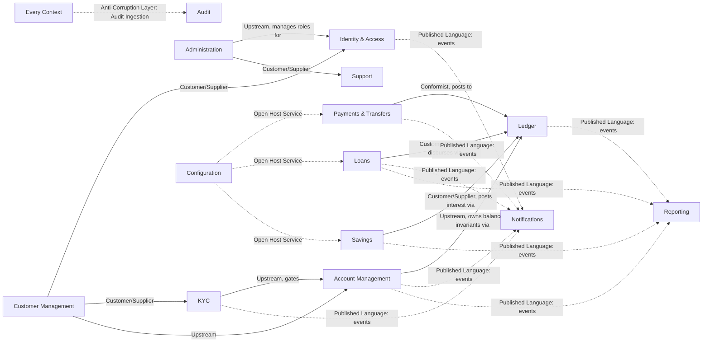

# Ecoswift Bank — Domain Architecture

**Phase 2A deliverable.** This document defines the business domain model for Ecoswift Bank: bounded contexts, aggregates, the context map between them, and how services communicate. It is architecture only — no schema, no code. See also [`business-rules.md`](business-rules.md), [`events.md`](events.md), [`workflows.md`](workflows.md), [`security-model.md`](security-model.md), and [`api-guidelines.md`](api-guidelines.md).

## How to read this document

Each bounded context maps, where one already exists, to a Phase 1 scaffolded service (`services/*`) or app (`apps/*`). Several contexts (Customer Management, Ledger, Support, Administration, Configuration) don't have a dedicated service yet — Phase 1 intentionally scaffolded only the services named in the original brief. Where a context has no home yet, it's noted so Phase 2B/3 can decide whether it becomes its own service or a module inside an existing one.

---

## Architectural Principles Applied

- **Domain-Driven Design**: the 14 contexts below are bounded contexts in the strict DDD sense — each owns its own ubiquitous language, its own aggregates, and its own data. No context reaches into another's persistence.
- **Clean / Hexagonal Architecture**: every context's domain core exposes **ports** (repository interfaces, gateway interfaces like `SmsGatewayPort`, `EmailGatewayPort`, `PaymentRailPort`) that infrastructure **adapters** implement (`PrismaAccountRepository`, `TwilioSmsAdapter`, `SmtpEmailAdapter`). The domain layer never imports Prisma, NestJS decorators bleed only into the adapter/application layers, not the domain model itself.
- **SOLID**: aggregates depend on abstractions (repository/gateway interfaces), not concrete infrastructure (Dependency Inversion); each domain service has one reason to change (Single Responsibility); new payment rails or notification channels are added via new adapters, not by modifying existing ones (Open/Closed).
- **CQRS, applied selectively** — not repo-wide, only where read and write models genuinely diverge:
  - **Ledger**: writes are immutable `JournalEntry` postings; reads are a denormalized `AccountBalance` projection kept eventually consistent via domain events. This is the clearest CQRS case in the system — balance reads must be fast and cannot wait on a full journal replay.
  - **Reporting**: pure read-side, built entirely from events/projections sourced from every other context. Reporting never writes back into another context's model.
  - **Account Management**: command side (open/freeze/close) is small and invariant-heavy; query side (account list, balance summary) is a read-optimized projection.
  - Everywhere else (Loans, Savings, KYC, Support, etc.), a single consistent read/write model is sufficient — introducing CQRS there would add complexity without a matching benefit.
- **Event-Driven Architecture**: state changes that matter to other contexts are published as domain events (catalog in `events.md`); contexts never poll or query another context's database directly.
- **Repository Pattern**: one repository per aggregate root, never per table/entity.
- **Dependency Injection**: constructor injection throughout (as already wired via Nest's DI container in Phase 1); domain services receive repositories/gateways as interfaces.

---

## Shared Kernel

A small set of value objects is shared across contexts by design (DDD "Shared Kernel" pattern) rather than duplicated or re-derived — they live in `@ecoswift/types` / `@ecoswift/shared` at the code level:

| Value Object | Definition | Used by |
|---|---|---|
| `Money` | `{ amount: decimal, currency: ISO4217 }`, immutable, arithmetic never mutates in place | Ledger, Payments & Transfers, Loans, Savings, Reporting |
| `CustomerId` | Opaque identifier (ULID) referencing a Customer Management aggregate | Nearly every context |
| `AccountNumber` | Opaque identifier (ULID + a human-facing display number) referencing a Bank Account | Ledger, Payments & Transfers, Reporting |
| `Actor` | `{ actorId, actorType: customer\|staff\|system, roles[] }` — who did a thing, for audit and authorization | Audit, Administration, Identity & Access |
| `CorrelationId` | Propagated through every request/event chain (already implemented in Phase 1 as `CorrelationIdMiddleware` / `x-correlation-id`) | All contexts |

Any change to a Shared Kernel value object requires cross-team agreement — that's the cost of a shared kernel, accepted here because these concepts are genuinely universal and redefining them per-context would cause silent inconsistency (e.g. two different `Money` rounding rules).

---

## Context Map

Relationship types follow standard DDD context-mapping vocabulary.

| Relationship | Meaning here |
|---|---|
| **Customer/Supplier** | Upstream context's model shapes the downstream one; downstream adapts (e.g. Account Management can't open an account for a customer KYC hasn't cleared). |
| **Conformist** | Downstream accepts upstream's model as-is with no translation (Payments conforms to Ledger's `Money`/posting model rather than inventing its own). |
| **Published Language / events** | Integration purely through well-defined domain events (`events.md`), no direct calls, no shared database. |
| **Open Host Service** | Configuration exposes a stable query API (`GET /config/{scope}/{key}`) that any context can call; it doesn't need to know its consumers. |
| **Anti-Corruption Layer** | Audit never trusts another context's internal model directly — every context publishes audit-worthy facts through a stable `AuditableEvent` envelope that Audit ingests, insulating Audit from every other context's internal changes. |

---

## Step 1 & 2 — Bounded Contexts, Aggregates, and Building Blocks

### 1. Identity & Access

- **Purpose**: owns authentication and authorization primitives — proving *who* is making a request and *whether* they're allowed to.
- **Responsibilities**: credential issuance/verification, session lifecycle, MFA/OTP, device trust, login risk signals.
- **Business capabilities**: register credentials, authenticate, refresh/revoke sessions, enroll/verify 2FA, lock/unlock accounts, evaluate login risk.
- **Dependencies**: Customer Management (a `UserAccount` is always linked 1:1 to a `Customer` or a `StaffMember`); Configuration (password/session policy parameters).
- **Public interfaces**: `POST /auth/login`, `POST /auth/refresh`, `POST /auth/logout`, `POST /auth/otp/verify`, `POST /auth/2fa/enroll` (synchronous REST); publishes auth events consumed by Notifications and Audit.
- **Maps to**: `services/auth-service` (Phase 1 scaffold).

| Building block | Items |
|---|---|
| Aggregate Roots | `UserAccount` |
| Entities | `Credential`, `Session`, `Device`, `OtpChallenge`, `TwoFactorMethod` |
| Value Objects | `Email`, `PhoneNumber`, `PasswordHash`, `IpAddress`, `UserAgent`, `RiskScore` |
| Domain Services | `PasswordPolicyService`, `SessionService`, `LoginRiskEvaluationService` |
| Repositories | `UserAccountRepository`, `SessionRepository` |
| Factories | `UserAccountFactory` (creates `UserAccount` + initial `Credential` atomically) |
| Specifications | `IsPasswordCompliantSpec`, `IsAccountLockedSpec`, `IsSessionExpiredSpec` |
| Policies | `LockoutPolicy`, `SessionExpiryPolicy`, `PasswordRotationPolicy` |

### 2. Customer Management

- **Purpose**: owns the customer's master profile — who they are, independent of how they authenticate or what accounts they hold.
- **Responsibilities**: profile data, contact details, addresses, next-of-kin, customer tiering, deduplication.
- **Business capabilities**: register customer, update profile, resolve duplicate customers, change tier.
- **Dependencies**: none upstream (this is a foundational context); downstream of nothing else.
- **Public interfaces**: `POST /customers`, `PATCH /customers/{id}`, `GET /customers/{id}`; publishes `CustomerRegistered` etc.
- **Maps to**: no dedicated service scaffolded in Phase 1 — candidate for a new `customer-service`, or a module fronted by `apps/api` in Phase 3, decided in Phase 2B/3.

| Building block | Items |
|---|---|
| Aggregate Roots | `Customer` |
| Entities | `ContactInfo`, `Address`, `NextOfKin` |
| Value Objects | `FullName`, `DateOfBirth`, `Nationality`, `CustomerId`, `CustomerTier` |
| Domain Services | `CustomerProfileService`, `DeduplicationService` |
| Repositories | `CustomerRepository` |
| Factories | `CustomerFactory` |
| Specifications | `IsProfileCompleteSpec`, `IsEligibleForTierUpgradeSpec` |
| Policies | `ProfileCompletenessPolicy`, `CustomerTierPolicy` |

### 3. KYC

- **Purpose**: gatekeeps regulatory identity verification before a customer can transact.
- **Responsibilities**: document collection, verification checks, risk/sanctions screening, tier-based verification depth.
- **Business capabilities**: submit KYC case, upload documents, run verification checks, approve/reject, trigger periodic re-verification.
- **Dependencies**: Customer Management (verifies a `Customer`); gates Account Management (no full account without cleared KYC).
- **Public interfaces**: `POST /kyc/cases`, `POST /kyc/cases/{id}/documents`, `GET /kyc/cases/{id}`; publishes `KYCApproved`/`KYCRejected` consumed by Account Management, Notifications, Audit.
- **Maps to**: `services/kyc-service`.

| Building block | Items |
|---|---|
| Aggregate Roots | `KycCase` |
| Entities | `KycDocument`, `VerificationCheck`, `RiskAssessment` |
| Value Objects | `DocumentType`, `VerificationStatus`, `KycRiskScore`, `TierLevel` |
| Domain Services | `DocumentVerificationService`, `SanctionsScreeningService` |
| Repositories | `KycCaseRepository` |
| Factories | `KycCaseFactory` |
| Specifications | `IsDocumentValidSpec`, `MeetsTierRequirementsSpec`, `IsSanctionsMatchSpec` |
| Policies | `KycTierPolicy`, `ReVerificationPolicy`, `SanctionsMatchPolicy` |

### 4. Account Management

- **Purpose**: owns the lifecycle of a customer's bank account as a product/record — not the money itself (that's Ledger's job).
- **Responsibilities**: account opening/closing, account state transitions, mandates/signatories, account-level limits.
- **Business capabilities**: open account, freeze/unfreeze, close, set limits, add signatory.
- **Dependencies**: KYC (must be cleared before opening beyond a restricted tier); Customer Management (account belongs to a `Customer`); collaborates with Ledger for balance truth.
- **Public interfaces**: `POST /accounts`, `POST /accounts/{id}/freeze`, `GET /accounts/{id}`; publishes `AccountOpened`, `AccountFrozen`, etc.
- **Maps to**: `services/account-service`.

| Building block | Items |
|---|---|
| Aggregate Roots | `BankAccount` |
| Entities | `AccountMandate`, `AccountLimit` |
| Value Objects | `AccountNumber`, `AccountType`, `AccountStatus`, `Currency` |
| Domain Services | `AccountOpeningService`, `AccountLifecycleService` |
| Repositories | `BankAccountRepository` |
| Factories | `BankAccountFactory` |
| Specifications | `IsEligibleForOpeningSpec`, `IsAccountActiveSpec`, `CanCloseAccountSpec` |
| Policies | `AccountFreezePolicy`, `DormancyPolicy`, `MinimumBalancePolicy` |

### 5. Ledger

- **Purpose**: the single source of truth for money. Every debit and credit in the bank, across every other context, ultimately becomes a posting here. This is deliberately the most conservative, invariant-heavy context in the system.
- **Responsibilities**: double-entry posting, balance projection, reconciliation, reversal handling.
- **Business capabilities**: post a balanced journal entry, project current balance, reverse a posting, reconcile against external statements.
- **Dependencies**: consumed by Payments & Transfers, Loans, Savings (they request postings, never write balances directly).
- **Public interfaces**: internal-only synchronous command API (`POST /ledger/postings`) called by trusted contexts; balance queries (`GET /ledger/accounts/{accountNumber}/balance`); publishes `JournalEntryPosted`, `BalanceAdjusted`.
- **Maps to**: no dedicated service scaffolded in Phase 1 — strong candidate to live inside `services/transaction-service` initially, split out once posting volume justifies its own service. This decision belongs to Phase 2B/3, not this document.

| Building block | Items |
|---|---|
| Aggregate Roots | `JournalEntry` (write side, immutable); `AccountBalance` (read-side projection, CQRS) |
| Entities | `Posting` (a single debit or credit line within a `JournalEntry`) |
| Value Objects | `Money`, `LedgerAccountCode`, `TransactionReference` |
| Domain Services | `DoubleEntryPostingService`, `ReconciliationService` |
| Repositories | `JournalEntryRepository` (append-only), `AccountBalanceRepository` |
| Factories | `JournalEntryFactory` (refuses to construct an unbalanced entry) |
| Specifications | `IsBalancedEntrySpec` (Σdebits = Σcredits), `IsReversibleSpec` |
| Policies | `PostingPolicy` (no updates/deletes, only compensating reversal entries), `CurrencyConsistencyPolicy` |

### 6. Payments & Transfers

- **Purpose**: orchestrates the customer-facing act of moving money — validation, limits, fraud checks — then delegates the actual posting to Ledger.
- **Responsibilities**: transfer validation, limit enforcement, routing (internal vs external rail), retry/idempotency of transfer requests.
- **Business capabilities**: initiate transfer, validate transfer, complete/fail transfer, reverse transfer.
- **Dependencies**: Account Management (source/destination must be active accounts); Ledger (conforms to its posting model); Configuration (limits, fee schedule).
- **Public interfaces**: `POST /transfers`, `GET /transfers/{id}`; publishes `TransferInitiated`, `TransferCompleted`, `TransferFailed`.
- **Maps to**: `services/transaction-service`.

| Building block | Items |
|---|---|
| Aggregate Roots | `TransferOrder` |
| Entities | `TransferLeg`, `FeeLine` |
| Value Objects | `TransferReference`, `Money`, `TransferChannel`, `TransferStatus` |
| Domain Services | `TransferValidationService`, `LimitEnforcementService`, `FraudCheckService` (hook — see `security-model.md`) |
| Repositories | `TransferOrderRepository` |
| Factories | `TransferOrderFactory` |
| Specifications | `IsWithinDailyLimitSpec`, `HasSufficientFundsSpec`, `IsDestinationValidSpec` |
| Policies | `DailyTransferLimitPolicy`, `VelocityCheckPolicy`, `TransferRetryPolicy` |

### 7. Loans

- **Purpose**: manages the lifecycle of credit products from application through payoff.
- **Responsibilities**: eligibility evaluation, approval workflow, disbursement request, repayment scheduling, delinquency tracking.
- **Business capabilities**: apply for loan, approve/reject, disburse, record repayment, flag delinquency, close loan.
- **Dependencies**: Customer Management, KYC (eligibility inputs); Account Management (disbursement/repayment account); Ledger (conforms to its posting model for disbursement/repayment); Configuration (product rate/term parameters).
- **Public interfaces**: `POST /loans/applications`, `POST /loans/applications/{id}/decision`, `GET /loans/{id}`; publishes `LoanRequested`, `LoanApproved`, `LoanRejected`, `LoanDisbursed`.
- **Maps to**: `services/loan-service`.

| Building block | Items |
|---|---|
| Aggregate Roots | `LoanApplication` (pre-approval); `Loan` (post-approval servicing) |
| Entities | `RepaymentSchedule`, `RepaymentInstallment`, `Collateral` (optional) |
| Value Objects | `LoanAmount`, `InterestRate`, `LoanTerm`, `EligibilityScore` |
| Domain Services | `LoanEligibilityService`, `RepaymentScheduleGeneratorService` (schedule shape only — no interest math yet), `DelinquencyService` |
| Repositories | `LoanApplicationRepository`, `LoanRepository` |
| Factories | `LoanApplicationFactory`, `LoanFactory` (constructed only from an approved application) |
| Specifications | `IsEligibleForLoanSpec`, `IsWithinDebtToIncomeRatioSpec`, `IsDelinquentSpec` |
| Policies | `LoanApprovalPolicy`, `DefaultHandlingPolicy`, `EarlyRepaymentPolicy` |

### 8. Savings

- **Purpose**: manages goal-based, flexible, and fixed-term savings products.
- **Responsibilities**: plan creation, contribution tracking, maturity handling, interest posting requests.
- **Business capabilities**: create savings plan, contribute, mature/roll over, withdraw (with or without penalty).
- **Dependencies**: Account Management (funding account); Ledger (conforms to its model for contributions/interest); Configuration (product rate parameters).
- **Public interfaces**: `POST /savings`, `POST /savings/{id}/contributions`, `POST /savings/{id}/withdraw`; publishes `SavingsCreated`, `SavingsMatured`, `InterestPosted`.
- **Maps to**: `services/savings-service`.

| Building block | Items |
|---|---|
| Aggregate Roots | `SavingsPlan` |
| Entities | `ContributionSchedule`, `InterestPosting` |
| Value Objects | `SavingsGoalAmount`, `MaturityDate`, `InterestRate`, `PlanType` |
| Domain Services | `MaturityService`, `InterestAccrualService` (accrual timing/eligibility only — no rate math yet) |
| Repositories | `SavingsPlanRepository` |
| Factories | `SavingsPlanFactory` |
| Specifications | `IsMaturedSpec`, `IsEarlyWithdrawalPenalizedSpec` |
| Policies | `MaturityPolicy`, `EarlyWithdrawalPolicy`, `AutoRenewalPolicy` |

### 9. Notifications

- **Purpose**: fans out domain events from every other context into customer/staff-facing messages across channels.
- **Responsibilities**: template rendering, channel routing, delivery attempt tracking, throttling.
- **Business capabilities**: queue notification, render from template, route to channel, retry failed delivery, suppress duplicates.
- **Dependencies**: consumes events from nearly every other context (Published Language integration only — never calls another context's API synchronously to decide *whether* to notify).
- **Public interfaces**: no public REST surface beyond internal health/status; primary interface is the event subscription itself. Delegates to channel adapters (`services/email-service`, `services/sms-service`) via `EmailGatewayPort` / `SmsGatewayPort`.
- **Maps to**: `services/notification-service` (orchestrator) + `services/email-service`, `services/sms-service` (channel adapters).

| Building block | Items |
|---|---|
| Aggregate Roots | `NotificationRequest` |
| Entities | `NotificationChannelAttempt` |
| Value Objects | `NotificationTemplate`, `Recipient`, `Priority`, `ChannelType` |
| Domain Services | `TemplateRenderingService`, `ChannelRoutingService` |
| Repositories | `NotificationRequestRepository` |
| Factories | `NotificationRequestFactory` |
| Specifications | `IsDeliverableSpec`, `IsDuplicateSuppressedSpec` |
| Policies | `RetryPolicy`, `NotificationRateLimitPolicy`, `QuietHoursPolicy` |

### 10. Reporting

- **Purpose**: the read-side aggregation layer — statements, dashboards, regulatory reports — built from events, never a source of truth itself.
- **Responsibilities**: statement compilation, regulatory report generation, scheduling.
- **Business capabilities**: request statement, generate scheduled report, export in a target format.
- **Dependencies**: consumes events from Ledger, Account Management, Loans, Savings, KYC (Published Language only).
- **Public interfaces**: `POST /reports`, `GET /reports/{id}`, `GET /statements/{accountId}`; publishes `StatementGenerated`, `RegulatoryReportGenerated`.
- **Maps to**: `services/reporting-service`.

| Building block | Items |
|---|---|
| Aggregate Roots | `ReportRequest` |
| Entities | `StatementLine`, `ReportSchedule` |
| Value Objects | `ReportPeriod`, `ReportFormat`, `ReportType` |
| Domain Services | `StatementCompilationService`, `RegulatoryReportBuilderService` |
| Repositories | `ReportRequestRepository`, `StatementRepository` |
| Factories | `ReportRequestFactory` |
| Specifications | `IsPeriodClosedSpec`, `IsReportDueSpec` |
| Policies | `RetentionPolicy`, `ReportSchedulingPolicy` |

### 11. Administration

- **Purpose**: internal operations — staff accounts, role assignment, system-level actions that require dual control.
- **Responsibilities**: staff provisioning, role/permission assignment, maker-checker workflow for sensitive actions.
- **Business capabilities**: provision staff, assign role, approve/reject a pending sensitive action.
- **Dependencies**: Identity & Access (a `StaffMember` has a linked `UserAccount`, composition not duplication).
- **Public interfaces**: `POST /admin/staff`, `POST /admin/staff/{id}/roles`, `POST /admin/actions/{id}/approve`; publishes `StaffProvisioned`, `RoleAssigned`, `AdminActionApproved`.
- **Maps to**: no dedicated service scaffolded in Phase 1 — natural home is a module behind `apps/admin` + `apps/api`, or its own `admin-service`; decided in Phase 2B/3.

| Building block | Items |
|---|---|
| Aggregate Roots | `StaffMember` |
| Entities | `RoleAssignment`, `PermissionOverride` |
| Value Objects | `StaffId`, `Department`, `EmploymentStatus` |
| Domain Services | `RoleAssignmentService`, `StaffProvisioningService` |
| Repositories | `StaffMemberRepository` |
| Factories | `StaffMemberFactory` |
| Specifications | `HasElevatedAccessSpec`, `IsActiveStaffSpec` |
| Policies | `SegregationOfDutiesPolicy`, `MakerCheckerPolicy` |

### 12. Support

- **Purpose**: customer support case management.
- **Responsibilities**: ticket intake, assignment, escalation, SLA tracking.
- **Business capabilities**: create ticket, assign, escalate, resolve, close.
- **Dependencies**: Customer Management (ticket belongs to a `Customer`); Administration (assignee is a `StaffMember`).
- **Public interfaces**: `POST /support/tickets`, `PATCH /support/tickets/{id}`; publishes `TicketCreated`, `TicketEscalated`, `SLABreached`.
- **Maps to**: no dedicated service scaffolded in Phase 1 — candidate for a new `support-service`.

| Building block | Items |
|---|---|
| Aggregate Roots | `SupportTicket` |
| Entities | `TicketMessage`, `Attachment`, `Escalation` |
| Value Objects | `TicketPriority`, `TicketCategory`, `SLADeadline` |
| Domain Services | `EscalationService`, `SLATrackingService` |
| Repositories | `SupportTicketRepository` |
| Factories | `SupportTicketFactory` |
| Specifications | `IsSLABreachedSpec`, `IsEscalationRequiredSpec` |
| Policies | `SLAPolicy`, `EscalationPolicy`, `TicketAutoClosePolicy` |

### 13. Audit

- **Purpose**: an immutable, tamper-evident record of everything that happened, for compliance and forensics. Audit trusts no other context's internal model — it only ingests a stable, versioned event envelope (Anti-Corruption Layer).
- **Responsibilities**: audit ingestion, integrity verification, long-term retention.
- **Business capabilities**: record audit fact, verify chain integrity, export for regulator/auditor.
- **Dependencies**: consumes an `AuditableEvent` envelope published by every other context — never queries another context's database.
- **Public interfaces**: no write API exposed to any context except the internal ingestion subscriber; `GET /audit/records` (read-only, permissioned).
- **Maps to**: `services/audit-service`.

| Building block | Items |
|---|---|
| Aggregate Roots | `AuditRecord` (flat, immutable) |
| Entities | none — deliberately flat |
| Value Objects | `ActorRef`, `ActionType`, `ResourceRef`, `AuditTimestamp`, `IntegrityHash` |
| Domain Services | `AuditIngestionService`, `IntegrityVerificationService` (hash-chain verification) |
| Repositories | `AuditRecordRepository` (append-only: no update, no delete) |
| Factories | `AuditRecordFactory` |
| Specifications | `IsChainIntactSpec` |
| Policies | `ImmutabilityPolicy`, `RetentionPolicy` (regulatory minimum retention), `WriteOnlyPolicy` |

### 14. Configuration

- **Purpose**: system-wide, versioned configuration — product parameters, fee schedules, feature flags — exposed as an Open Host Service so every other context reads the same values.
- **Responsibilities**: config storage, versioning, scoped evaluation, change approval.
- **Business capabilities**: set config value, toggle feature flag, evaluate effective value for a scope, approve a pending change.
- **Dependencies**: none upstream; downstream consumers are Payments & Transfers, Loans, Savings, Identity & Access (policy parameters), Notifications (quiet hours, throttles).
- **Public interfaces**: `GET /config/{scope}/{key}`, `POST /config/{scope}/{key}` (maker-checker gated); publishes `ConfigurationChanged`, `FeatureFlagToggled`.
- **Maps to**: extends `packages/config` at the code level (already the Phase 1 home for env/branding constants); a runtime, staff-editable configuration store is a new capability introduced in this phase's design, realized in Phase 2B/3.

| Building block | Items |
|---|---|
| Aggregate Roots | `ConfigurationSet` |
| Entities | `ConfigurationEntry`, `FeatureFlag` |
| Value Objects | `ConfigKey`, `ConfigValue`, `ConfigScope`, `EffectiveDate` |
| Domain Services | `ConfigValidationService`, `FeatureFlagEvaluationService` |
| Repositories | `ConfigurationRepository` |
| Factories | `ConfigurationSetFactory` |
| Specifications | `IsValidForScopeSpec`, `IsEffectiveSpec` |
| Policies | `ChangeApprovalPolicy` (maker-checker), `ConfigVersioningPolicy` |

---

## Step 6 — Service Communication

### Synchronous (REST)

Used only where the caller needs an immediate, consistent answer to proceed:

- Client-facing requests (`apps/api`, `apps/mobile-api` → any service): always synchronous REST, per `api-guidelines.md`.
- **Trusted internal command calls** where a same-transaction-like guarantee is needed, e.g. Payments & Transfers → Ledger posting request. This is the one place a context calls directly into another rather than going through events, because a transfer cannot be reported "completed" until the posting is confirmed. It's modeled as a **synchronous command with an idempotency key**, not a query.
- Everything else that only *reads* another context's data goes through that context's own read API (e.g. Reporting calling Account Management's `GET /accounts/{id}` for point-in-time detail it hasn't yet received as an event) — used sparingly, event projections are preferred.

### Asynchronous (Domain Events)

The default integration mechanism between contexts. A context publishes what happened; it does not know or care who's listening.

- **Transport**: an event bus abstraction (`EventPublisherPort` / `EventSubscriberPort`) sits behind every context's domain layer. The concrete broker (candidates: Redis Streams — already in the stack — RabbitMQ, or Kafka) is an infrastructure decision deferred to Phase 2B/3; the domain layer is written against the port, not the broker SDK, so that decision doesn't ripple through business logic later (Dependency Inversion again).
- **Delivery guarantee**: at-least-once. Every consumer must be idempotent (see below) because the same event may be delivered more than once.
- **Outbox pattern**: a context publishes an event in the same database transaction as the state change that caused it (write to an `outbox` table, a separate relay publishes to the bus). This is how "Ledger posts a journal entry AND reliably emits `JournalEntryPosted`" avoids the classic dual-write inconsistency — implementation detail for Phase 2B, called out here because it's the reason the event catalog can promise delivery guarantees at all.

### Idempotency

- Every command that causes a state change (`POST /transfers`, `POST /ledger/postings`, event handlers) accepts/derives an **idempotency key**. Replaying the same key returns the original result without re-executing the effect.
- For Payments & Transfers specifically: the client-supplied idempotency key is required on `POST /transfers` — this is a banking system, "did my transfer double-post because of a retry" is not an acceptable failure mode.

### Retry & Failure Recovery

- **Consumer-side retry**: exponential backoff with jitter, bounded attempt count, per consumer.
- **Dead-letter queue (DLQ)**: an event that exhausts retries lands in a DLQ for manual/automated replay rather than being silently dropped.
- **Circuit breaking**: synchronous calls to Ledger and to external gateways (SMS/email/payment rails) are wrapped with a circuit breaker so a downstream outage degrades gracefully (e.g. queue the transfer for retry) instead of cascading.

### Event Replay

- Because Audit ingests a full, ordered, immutable copy of every `AuditableEvent`, it doubles as a replay source: a consumer that needs to rebuild a projection (e.g. Reporting rebuilding a statement projection after a bug fix) can replay from Audit's ordered log rather than needing every producing context to support replay individually.
- Projections (like `AccountBalance` in Ledger) are designed to be rebuildable from the journal from scratch — a projection is never the only copy of the truth.

---

## Architectural Risks & Recommendations

Carried forward into the Phase 2A stop-condition review (see chat summary), recorded here for traceability:

1. **Ledger's home is undecided.** Modeling it as its own bounded context is correct DDD; whether it's implemented as a module inside `transaction-service` or split into its own service is a scaling decision, not a domain one. Recommendation: start inside `transaction-service`, extract when posting volume or independent-scaling needs justify it.
2. **Customer Management, Support, Administration, and a runtime Configuration store have no Phase 1 service.** They're fully designed here so Phase 2B (schema) and Phase 3 (implementation) aren't blocked, but someone needs to decide their eventual home (new services vs. modules) before Phase 3.
3. **Outbox pattern and concrete event broker are named but not chosen.** This document deliberately keeps the domain layer broker-agnostic; the broker choice is infrastructure, not domain, and should be made in Phase 2B/3 with real throughput numbers.
4. **The `LoanApplication` → `Loan` split (two aggregates for one lifecycle) is a judgment call.** It keeps the approval workflow's invariants separate from the servicing workflow's invariants, but it means "find my loan" requires knowing which aggregate to query pre- vs. post-approval. Acceptable trade-off; flagged so it isn't rediscovered as a surprise later.
5. **Phase 1 infrastructure (single `postgres` container, single `prisma/schema.prisma`) is in tension with "each context owns its data."** A shared database is workable — many production systems run bounded contexts against one physical Postgres instance — but only if Phase 2B enforces the boundary a different way: one schema (in the Postgres `CREATE SCHEMA` sense) per bounded context, with no cross-schema foreign keys, and each service's Prisma client scoped to only its own schema. Without that discipline, the physical convenience of one database quietly erodes the logical separation this document defines, and two contexts end up coupled by a shared table before anyone decides to couple them. This is the single highest-priority item for Phase 2B to resolve explicitly, not default into.
