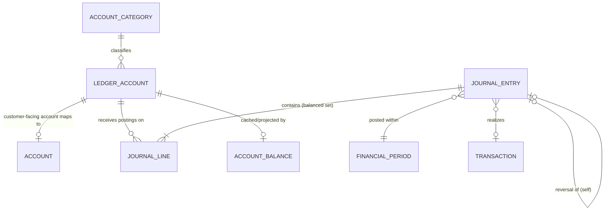
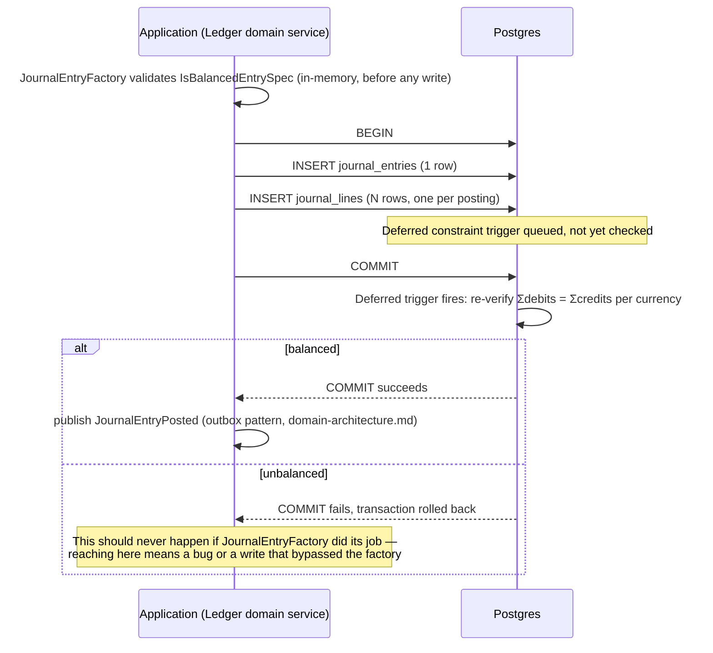

# Ecoswift Bank — Ledger Design

**Phase 2B deliverable.** The double-entry accounting architecture — the part of this database that must be right, because everything else (displayed balances, statements, reports) is downstream of it. This document is the detailed companion to the "Accounting / Ledger" section of [`database-architecture.md`](database-architecture.md).

## The Non-Negotiable Rule

> Ecoswift Bank must NEVER rely on a mutable account balance as the financial source of truth. The ledger is the source of truth. Displayed balances may be maintained as projections or caches but must always reconcile to the ledger. Every financial transaction must create balanced debit and credit entries. No transaction may leave the ledger in an unbalanced state.

Everything below exists to make that true not just by convention, but by construction — enforced at the database level, not only trusted to application code.

## Core Model

Four tables, three of which are genuinely just double-entry accounting theory made relational:



- **`AccountCategory`** — the five fundamental accounting categories (Asset, Liability, Equity, Revenue, Expense), each with a `normalBalance` (Debit or Credit) side. This *is* the top level of the chart of accounts.
- **`LedgerAccount`** — a chart-of-accounts leaf entry. This *is* the chart of accounts and, collectively with `JournalEntry`/`JournalLine`, the general ledger — there is no separate "GeneralLedger" or "ChartOfAccounts" table, because inventing one would just be a second copy of what these already represent, with its own drift risk. Every customer-facing `Account` maps 1:1 to exactly one `LedgerAccount` (its position in the general ledger); internal bank accounts (Interest Income, Fee Income, Retained Earnings, etc.) have no linked customer `Account`.
- **`JournalEntry`** — an immutable, balanced financial event. Never updated, never deleted.
- **`JournalLine`** — one debit or credit posting within a `JournalEntry`. `amount` is always positive; `direction` (`DEBIT`/`CREDIT`) carries the sign meaning, not a negative number — this avoids an entire class of "did someone flip the sign" bugs that plague ledgers built on signed amounts.
- **`AccountBalance`** — the one deliberate exception to "nothing here is mutable": a read-optimized **projection**, explicitly documented as a cache, always reconstructible by summing `JournalLine`s for the same `ledgerAccountId`. This is the CQRS read model referenced in `domain-architecture.md` § Architectural Principles.

## Why a Projection, Not a Live Aggregate Query

Two honest options exist for "what's this account's balance": (a) `SUM()` the journal at read time, or (b) maintain a projection. Ecoswift Bank does (b), for one reason: balance reads are the single most frequent query in a banking system, and summing an ever-growing append-only journal at request time gets slower in direct proportion to how long the account has existed — exactly the accounts with the most history are the ones that would be slowest to check. The projection exists purely for that performance reason, **not** as an alternate source of truth — reconciliation (summing the journal and comparing to the projection) is a first-class, expected operation, not an emergency procedure.

## Posting Flow



Two layers of defense, deliberately redundant:

1. **Application layer** (`JournalEntryFactory`, per `domain-architecture.md` — not implemented in this phase, Phase 2B is data architecture only): refuses to even attempt constructing an unbalanced entry. This is the layer that should catch every legitimate case.
2. **Database layer** (this phase's deliverable): a deferred constraint trigger that re-verifies the same invariant at commit time, regardless of what wrote the rows. This is the layer that catches everything the first layer didn't — a bug, a direct-SQL write, a future service that forgot to use the factory.

## The Balanced-Entry Trigger

A `JournalEntry`'s lines are written as a set — one `INSERT` per line, within a single database transaction. A naive `AFTER INSERT` trigger checking balance on *every individual row* would reject the first line of any multi-line entry, before the rest exist yet. This is exactly the scenario Postgres's **deferred constraint triggers** exist for: `DEFERRABLE INITIALLY DEFERRED` postpones the check until `COMMIT` (or an explicit `SET CONSTRAINTS ... IMMEDIATE`), by which point every line in the entry has been written.

```sql
CREATE OR REPLACE FUNCTION fn_enforce_balanced_journal_entry() RETURNS trigger AS $$
DECLARE
  affected_entry_id uuid;
  unbalanced_count integer;
BEGIN
  affected_entry_id := COALESCE(NEW."journal_entry_id", OLD."journal_entry_id");

  SELECT count(*) INTO unbalanced_count
  FROM (
    SELECT "currency_id",
           SUM(CASE WHEN "direction" = 'DEBIT' THEN "amount" ELSE 0 END) AS total_debit,
           SUM(CASE WHEN "direction" = 'CREDIT' THEN "amount" ELSE 0 END) AS total_credit
    FROM "journal_lines"
    WHERE "journal_entry_id" = affected_entry_id
    GROUP BY "currency_id"
  ) balances_by_currency
  WHERE total_debit <> total_credit;

  IF unbalanced_count > 0 THEN
    RAISE EXCEPTION 'Unbalanced journal entry % : total debits must equal total credits within each currency', affected_entry_id;
  END IF;

  RETURN NULL;
END;
$$ LANGUAGE plpgsql;

CREATE CONSTRAINT TRIGGER trg_enforce_balanced_journal_entry
  AFTER INSERT ON "journal_lines"
  DEFERRABLE INITIALLY DEFERRED
  FOR EACH ROW EXECUTE FUNCTION fn_enforce_balanced_journal_entry();
```

Balance is checked **per currency** within the entry, not just globally — a cross-currency entry (rare, but the schema doesn't forbid it structurally) must balance within each currency independently; debits in USD can't be offset by credits in EUR.

Full source: `prisma/migrations/<timestamp>_init_banking_schema/migration.sql`, appended section.

### Live verification (not just asserted — actually run against Postgres 16)

**Unbalanced entry — rejected at COMMIT:**

```
--- Attempting UNBALANCED entry (should fail) ---
BEGIN
INSERT 0 1
INSERT 0 1
ERROR:  Unbalanced journal entry 66666666-6666-6666-6666-666666666666 : total debits must equal total credits within each currency
CONTEXT:  PL/pgSQL function fn_enforce_balanced_journal_entry() line 20 at RAISE
```

**Balanced entry — accepted:**

```
--- Attempting BALANCED entry (should succeed) ---
BEGIN
INSERT 0 1
INSERT 0 1
COMMIT
```

**Immutability — UPDATE and DELETE both rejected on posted rows:**

```
--- Attempting to UPDATE a posted journal_line (should fail, immutability) ---
ERROR:  UPDATE on journal_lines is not permitted: this table is append-only
--- Attempting to DELETE a posted journal_entry (should fail, immutability) ---
ERROR:  DELETE on journal_entries is not permitted: this table is append-only
```

**Check constraint — negative amount rejected:**

```
--- Attempting a negative journal_line amount (should fail check constraint) ---
ERROR:  new row for relation "journal_lines" violates check constraint "journal_lines_amount_positive"
```

## Immutability & Corrections

`journal_entries` and `journal_lines` reject `UPDATE`/`DELETE` unconditionally, via `fn_prevent_mutation` (shared with `audit_logs`, which has the same "append-only, tamper-evident" requirement per `security-model.md`). A posting mistake is corrected by posting a **new** entry that reverses the original:

- `JournalEntry.reversalOfJournalEntryId` — a self-referential, unique FK. A reversal entry points at what it reverses; the original can look up its reversal via the reverse relation. At most one reversal per original entry in this model — a second correction is a new scenario with its own entry chain, not a re-reversal of the same row.
- The reversal entry is itself a completely normal, independently balanced `JournalEntry` — it doesn't get special-cased by the balance trigger, it just happens to contain the mirror-image postings of the original.

## Financial Periods

`FinancialPeriod` (`OPEN` → `CLOSED` → `LOCKED`) exists so that, once implemented in Phase 3, closing a period can refuse new postings against it — every `JournalEntry` carries a `financialPeriodId`, giving period-close logic a clean FK to enforce against rather than a date-range guess. Not enforced by a trigger in this phase (which period is "current" and what closing means operationally is a Phase 3 business-logic concern) — the schema just makes sure the data shape supports it correctly from day one, which is the point of doing this now rather than retrofitting it later.

## Reconciliation

Because `AccountBalance` is explicitly a projection, reconciliation isn't a special/emergency procedure — it's the projection's normal validity check:

```sql
-- What the ledger says an account's balance is (the truth)
SELECT
  jl.ledger_account_id,
  jl.currency_id,
  SUM(CASE WHEN jl.direction = 'DEBIT' THEN jl.amount ELSE -jl.amount END) AS ledger_balance
FROM journal_lines jl
WHERE jl.ledger_account_id = $1
GROUP BY jl.ledger_account_id, jl.currency_id;

-- Compared against what the cache says (should always match)
SELECT current_balance FROM account_balances WHERE ledger_account_id = $1;
```

A mismatch here is a P1 — it means the projection update (triggered by `JournalEntryPosted`, per `domain-architecture.md`) failed or raced, not that the ledger itself is wrong; `AccountBalance.lastReconciledAt` exists precisely to track when this check last ran clean, and `AccountBalance.version` exists to protect the projection's own update path from lost-update races when multiple postings affecting the same account land concurrently.

## Partitioning

`journal_lines` is the highest-value partitioning candidate in the entire schema: append-only, unbounded growth, and every query against it is naturally time-scoped (a statement period, a reconciliation window, a specific ledger account's recent activity). Recommended: native Postgres **range partitioning by `created_at`, monthly**.

Reference DDL (not applied to the live migration in this phase — see `database-architecture.md` § Table Partitioning for why):

```sql
-- Applied as a dedicated ops migration once volume projections justify it,
-- against a schema that has stabilized past active Phase 2B/2C/3 iteration.

-- 1. Rename the existing table out of the way
ALTER TABLE journal_lines RENAME TO journal_lines_unpartitioned;

-- 2. Create the partitioned parent with the same shape
CREATE TABLE journal_lines (
  LIKE journal_lines_unpartitioned INCLUDING ALL
) PARTITION BY RANGE (created_at);

-- 3. Create partitions (example: two months, extend via a scheduled job —
--    e.g. pg_partman, or a simple cron-triggered migration — that creates
--    the next partition ahead of need)
CREATE TABLE journal_lines_2026_07 PARTITION OF journal_lines
  FOR VALUES FROM ('2026-07-01') TO ('2026-08-01');
CREATE TABLE journal_lines_2026_08 PARTITION OF journal_lines
  FOR VALUES FROM ('2026-08-01') TO ('2026-09-01');

-- 4. Backfill from the old table, then swap
INSERT INTO journal_lines SELECT * FROM journal_lines_unpartitioned;
-- (verify row counts and a reconciliation check match before dropping)
DROP TABLE journal_lines_unpartitioned;

-- Note: the deferred balance-check trigger and immutability trigger must be
-- re-created on the new partitioned parent — triggers are not carried over
-- by `LIKE ... INCLUDING ALL` for a table that's being partitioned.
```

`audit_logs` is the second candidate, same reasoning (append-only, unbounded, time-scoped queries), same deferred-application approach.

## What This Phase Deliberately Did Not Do

Per the Phase 2B brief's explicit scope: no controllers, services, REST APIs, or business logic. Concretely, that means `JournalEntryFactory`, `DoubleEntryPostingService`, and `ReconciliationService` (named as domain services in `domain-architecture.md`) are **designed, not implemented** — this document describes the contract they must uphold and proves the database will hold that contract even if they don't, but writing them is Phase 3's job.
