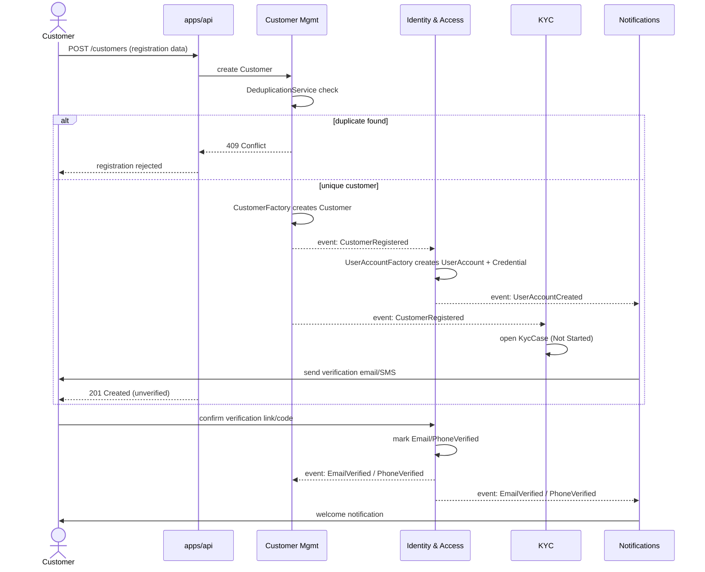
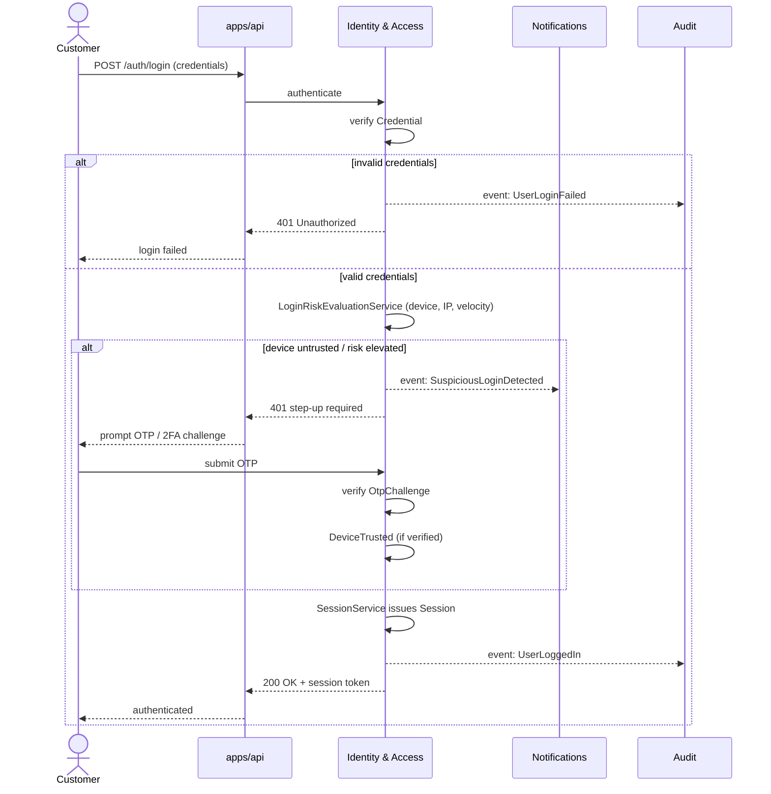
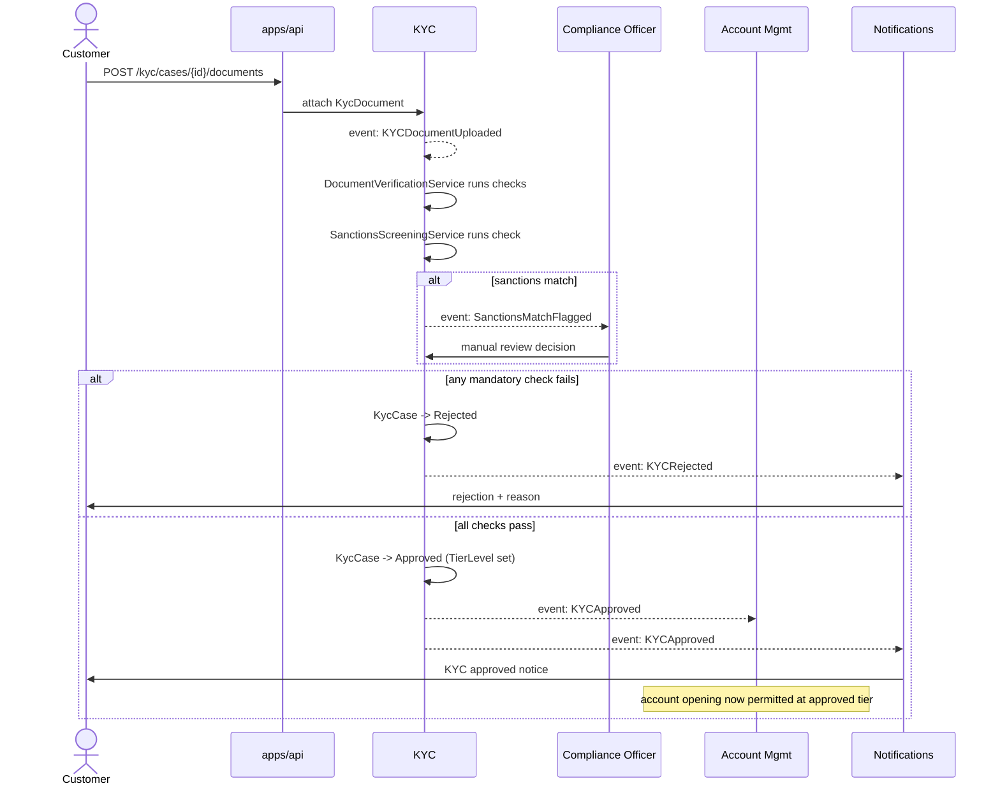
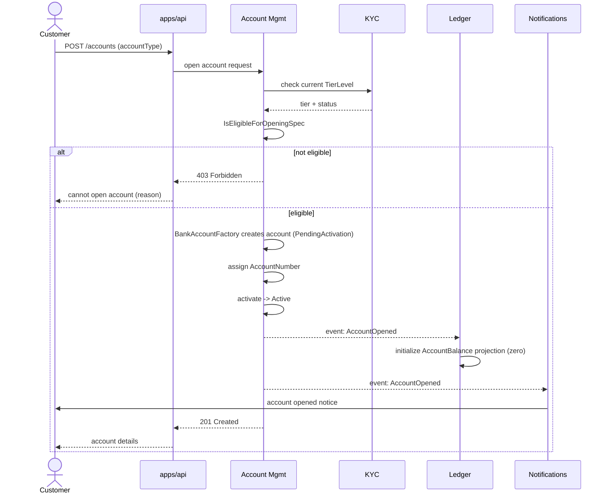
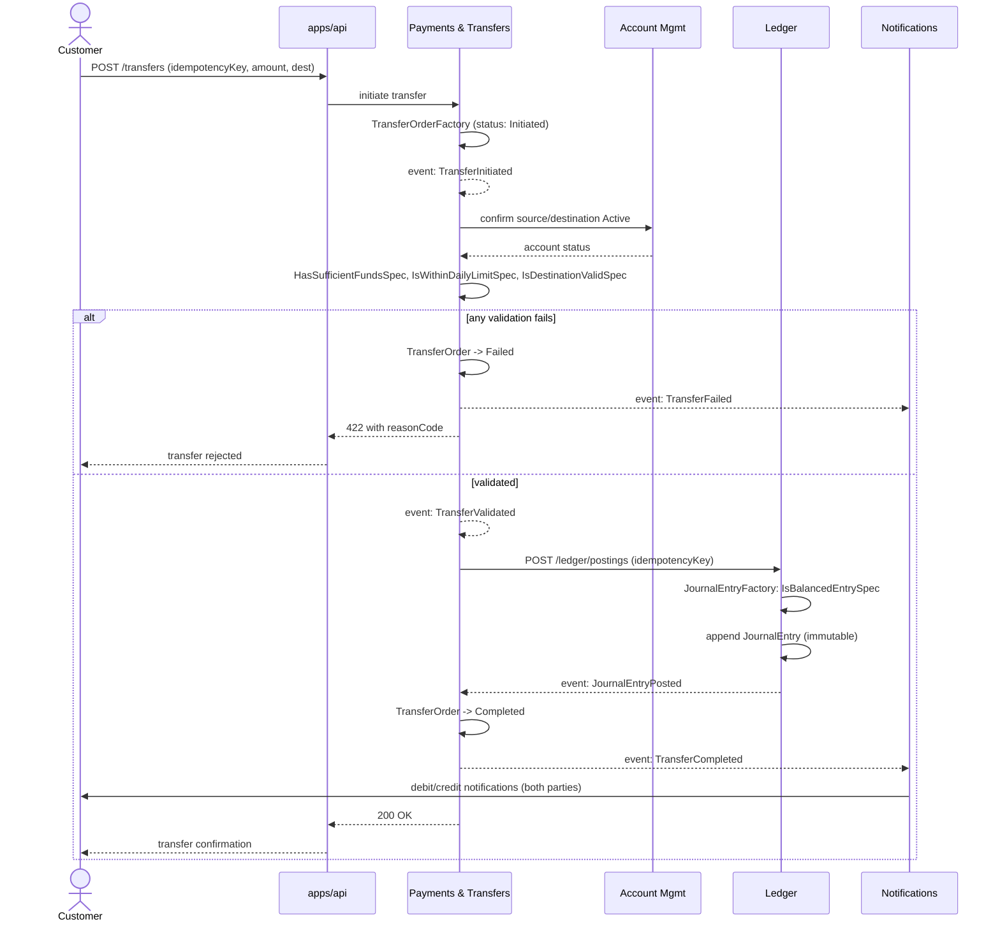
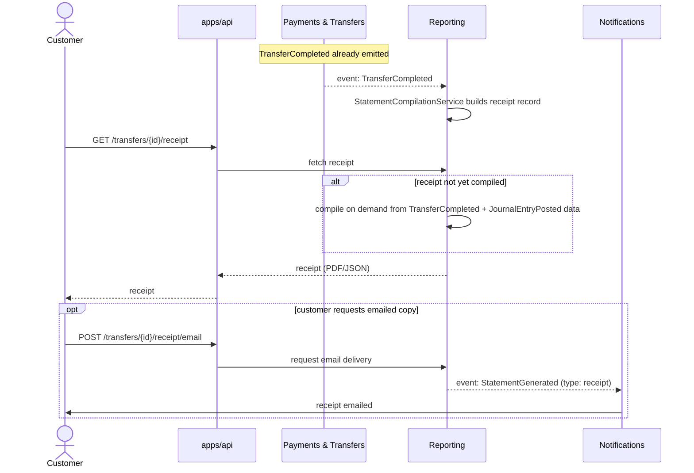
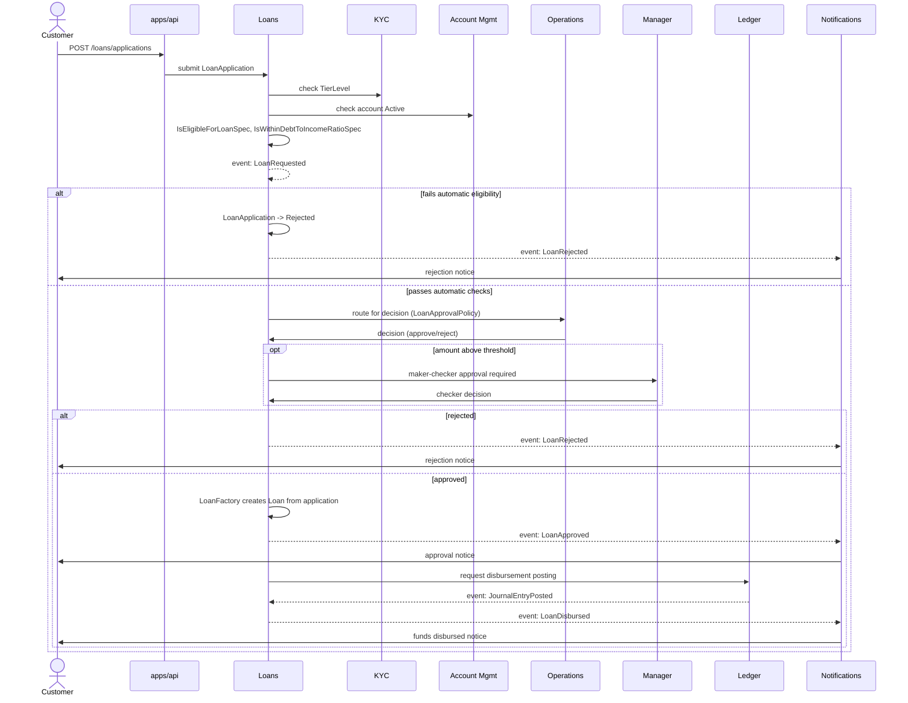
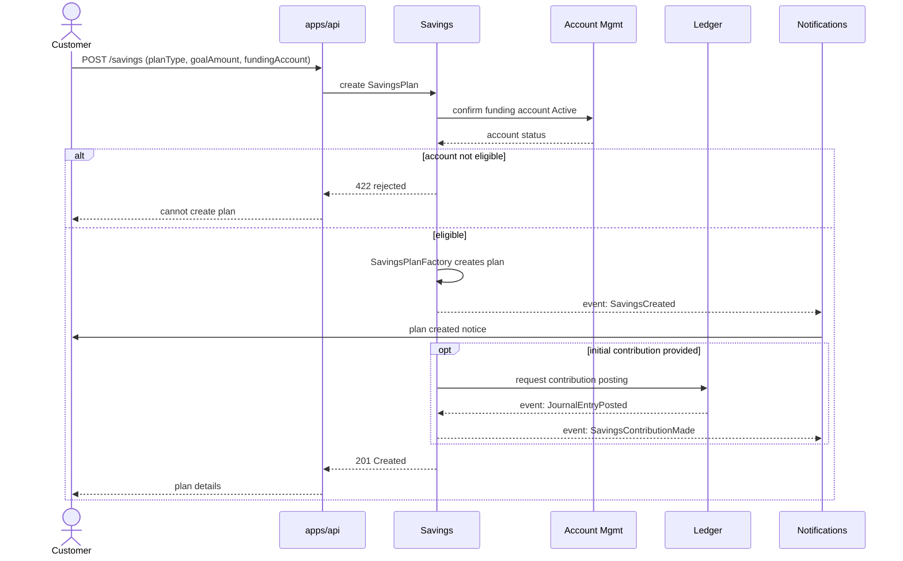
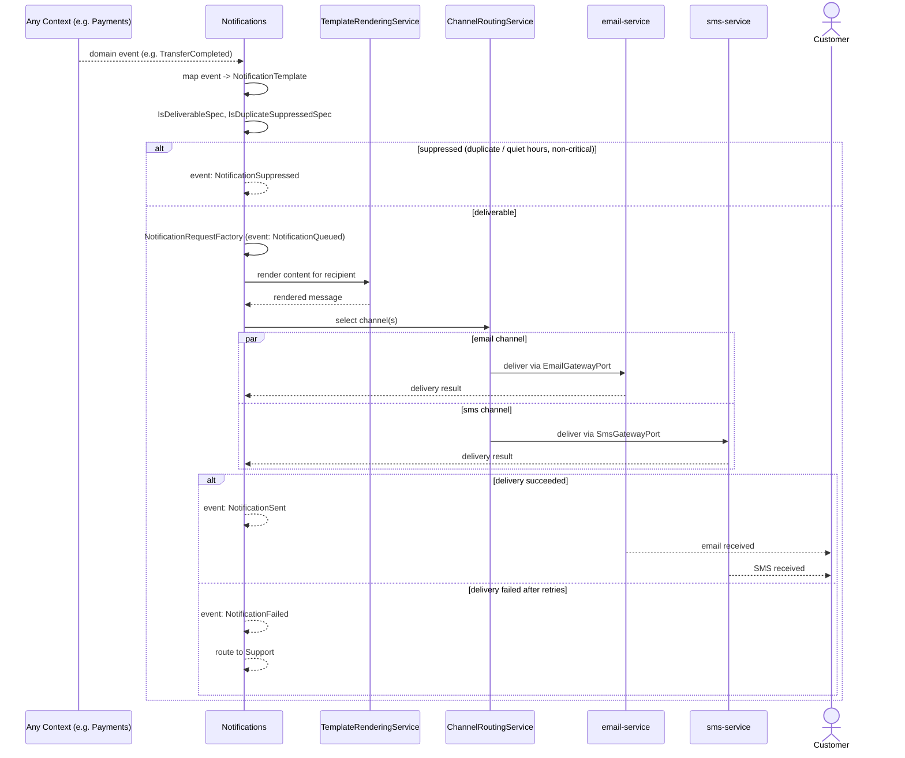
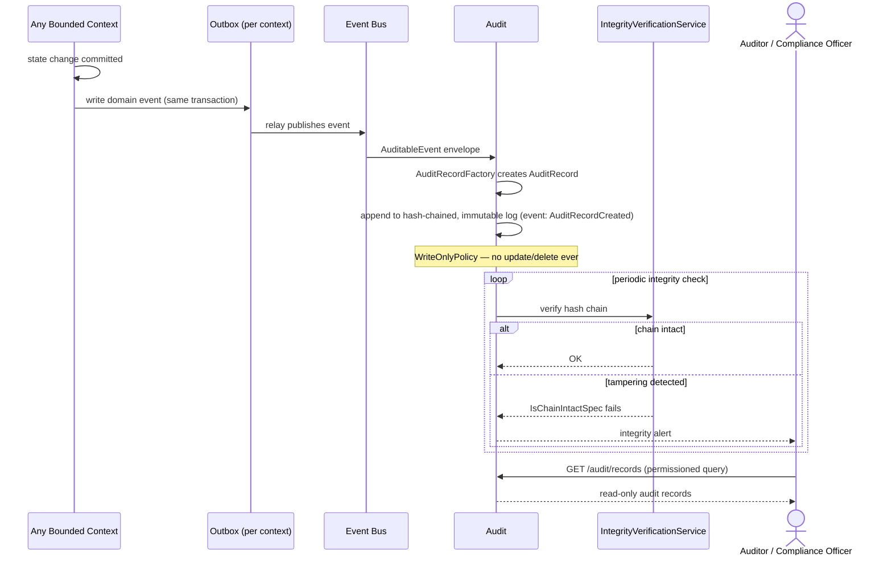

# Ecoswift Bank — Workflows

**Phase 2A deliverable.** Sequence diagrams for the ten key workflows, using the contexts, aggregates, and events already defined in [`domain-architecture.md`](domain-architecture.md) and [`events.md`](events.md). These describe orchestration, not implementation — no code, no schema.

Diagrams use each context's short name as the participant (e.g. `Payments & Transfers` → `Payments`) for readability; participant order follows the Context Map's dependency direction where possible.

---

## 1. Customer Registration

## 2. Login

## 3. KYC Approval

## 4. Account Opening

## 5. Money Transfer

## 6. Receipt Generation

## 7. Loan Application

## 8. Savings Creation

## 9. Notification Flow

## 10. Audit Logging

